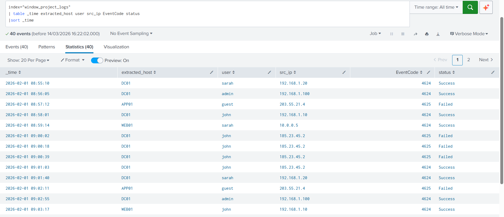
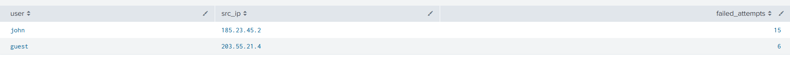
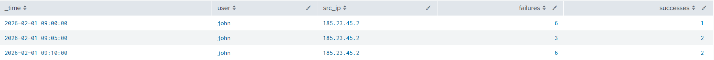
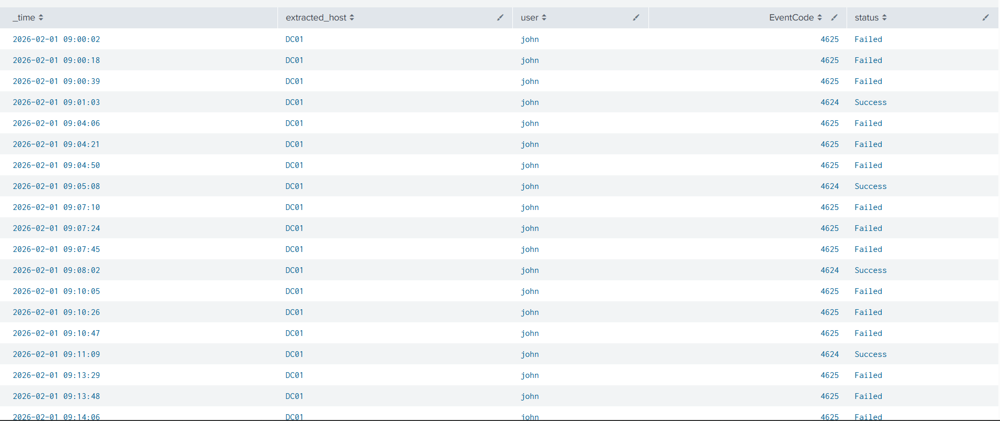

# SOC Brute Force Detection Using Splunk

## Project Overview
As someone starting my journey into cybersecurity and SOC operations, I wanted to understand how brute force attacks are detected and investigated in a real environment. In this project, I simulated authentication logs and used Splunk to identify suspicious login activity.

The scenario recreates a common SOC alert: multiple failed login attempts from an external IP address followed by a successful login. I then investigated the events, built a timeline of the attack, and documented the findings in a simple incident report.

This project reflects the typical workflow of a SOC analyst — detecting an alert, analysing logs, understanding what happened, and reporting the incident.

## Dataset
The dataset contains simulated Windows authentication logs including:

- EventCode **4624** – Successful login  
- EventCode **4625** – Failed login  

Key fields used in the investigation:

- `_time`
- `host`
- `user`
- `src_ip`
- `EventCode`
- `status`

## Investigation Evidence

### Authentication Logs

### Failed Login Attempts

### Brute Force Detection Query

### Attacker IP Investigation

## Skills Demonstrated

- Splunk SIEM investigation
- SPL detection queries
- Windows authentication log analysis
- Brute force attack detection
- Security incident documentation
